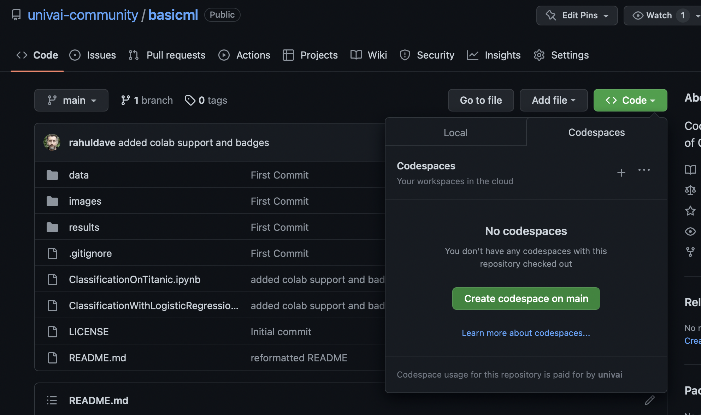

# VisualizeWithMatplotlib

Code-First Basic Visualization Part of Code With Rahul.

## How to learn

Run the notebooks! You have 3 options:

1. Fork/Clone or Clone to your own machine and run the notebooks there (this assumes you have a working jupyterlab setup with sklearn installed)
2. You can open the notebooks in Colab with the links provided below
3. You can use Github Codespaces right here to run the code. You will need to be signed in to your github account. Then, click on the green "Code" button and navigate to the Codespaces tab. It looks like this:

.

Create the codespace by clicking on the "Create Codespace on main" green button. The repository will open up in Visual Studio Code (VSC). You can use the jupyter notebooks there since VSC supports Jupyter kernels. I recommend a light theme to go with the images I have used. If you forked this repo you can even add/commit/push your changes from VSC. 

If you add a "/?editor=jupyter" to the codespace link, you can even open the codespace in Jupyterlab (this can be set as default in your settings)

## The Notebooks

(1) Start with plotting.ipynb . This notebook introduces the basic concepts of
plotting with matplotlib, including the object-oriented API.

(2) In improving_figures.ipynb we'll take a bar chart and clean it up step by step as an example of reducing charjunk and increasing the clarity of a visualization

(3) In some_things_about_visualization.ipynb we'll talk about different displays for different kind of data and the use of spatial and color information in making visualizations

## Exercise

As a post workshop exercise, tackle homework.ipynb which will help you make a discovery about bacterial classes which was hidden for 30 years! We'll discuss it on the `#code-with-rahul` channel at our [Discord](https://discord.gg/vSjGrYjnWg).
